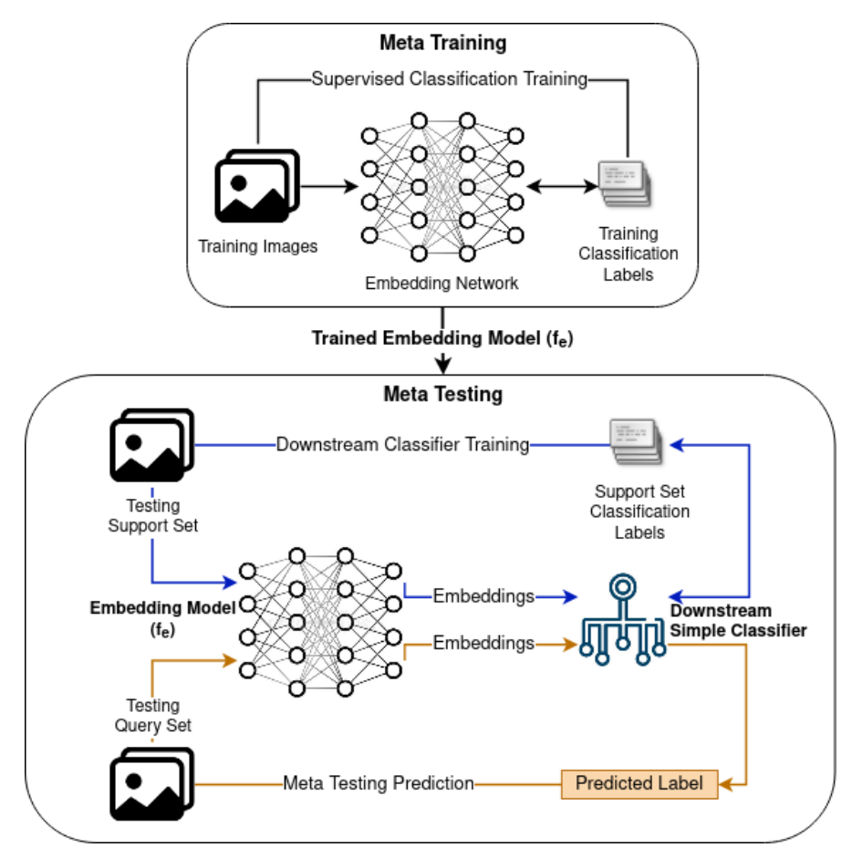

#  Dermoscopic Image Analysis for Lesion Detection using Few-Shot Learning

Model building, experiments, references and source code for the research work on skin image analysis that draws on meta-learning to improve performance in low data and imbalanced data regimes. 

## Quick Links

The following references will help in reproducing this implementation and to extend the experiments for further analyses.

- [Dataset Sources, Splitting Phases, and Experiment Descriptions [Markdown]](./Experiments/data/README.md)
- [Manuscript [PDF]](./Docs/Manuscript_arXiv.pdf)

## Cite Us

[Link to the Research Paper (preprint)](https://arxiv.org/abs/2210.16954)

If you find our work useful in your research, don't forget to cite us:

```
@article{https://doi.org/10.48550/arxiv.2210.16954,
  doi = {10.48550/ARXIV.2210.16954},  
  url = {https://arxiv.org/abs/2210.16954},  
  author = {Desingu, Karthik and P., Mirunalini and Chandrabose, Aravindan},  
  keywords = {Computer Vision and Pattern Recognition (cs.CV), Artificial Intelligence (cs.AI), Machine Learning (cs.LG), FOS: Computer and information sciences, FOS: Computer and information sciences},  
  title = {Few-Shot Classification of Skin Lesions from Dermoscopic Images by Meta-Learning Representative Embeddings},  
  publisher = {arXiv},  
  year = {2022},  
  copyright = {Creative Commons Attribution 4.0 International}
}
```

## Motivation

- Annotated images and ground truth for the **diagnosis of rare and novel diseases** are scarce. This is expected to prevail, considering the small number of affected patient population and limited specialized clinical expertise to annotate images. 
- Further, the frequently occurring **long-tailed class dataset distributions** in skin lesion and other disease classification datasets cause conventional training approaches to lead to **poor generalization** due to **biased class priors**. 
- Few-shot learning, and meta-learning in general, aim to overcome these issues by **attempting to perform well in low data regimes**. 

## Proposed Embedding Network & Base-Learner Approach for Meta-Learning

This work focuses on improving meta-learning for the **characterization of lesion types** from dermoscopic images.   
Specifically, it proposes a two-stage training and inference approach,
- A **baseline supervised learner** on the meta-training set that allows a network to learn highly representative and generalizable feature embeddings for images, that are readily transferable to new few-shot learning tasks.
- Positing that a representative feature embedding can be more effective than complex meta-learning algorithms, a **simple classifier** is trained atop these representations for downstream classification into lesion types.

  

## Key References

### [[CVPR-2020] Meta-DermDiagnosis Few-Shot Skin Disease Identification using Meta-Learning.pdf](./Literature/%5BCVPR-2020%5D%20Meta-DermDiagnosis%20Few-Shot%20Skin%20Disease%20Identification%20using%20Meta-Learning.pdf)

- Proposes the use of meta-learning techniques for efficient model adaptation for extremely low-data scenarios
- Applies Group equivariant convolutions (G-convolutions) in place of the normal spatial convolution filters
- Two network implementations: 
    - Reptile: Gradient-based meta-learning
    - Prototypical networks using Euclidean Distance
- Evaluated on ISIC 2018, Derm7pt and SD-198 datasets
- Outperforms DAML on ISIC 2018
- Implementation Code NOT available

### [[CVPR-2018] Learning to Compare Relation Network for Few-Shot Learning](./Literature/%5BCVPR-2018%5D%20Learning%20to%20Compare%20Relation%20Network%20for%20Few-Shot%20Learning.pdf)

- The paper that proposed Relation Networks for Few-Shot Learning

### [[NeurIPS-2017] Prototypical Networks for Few-shot Learning](./Literature/%5BNeurIPS-2017%5D%20Prototypical%20Networks%20for%20Few-shot%20Learning.pdf)

- The paper that proposed Protoypical Networks for Few-Shot Learning

### [[Elsevier-PR-2020] Temperature network for few-shot learning with distribution-aware large-margin metric](./Literature/%5BElsevier-PR-2020%5D%20Temperature%20network%20for%20few-shot%20learning%20with%20distribution-aware.pdf)

- An improvement of Prototypical Networks, by generating query-specific prototypes and thus results in local
and distribution-aware metric 
- Sets different temperature for different categories to penalize query samples that are not close enough to their belonging categories.
- *Code available - PyTorch*
